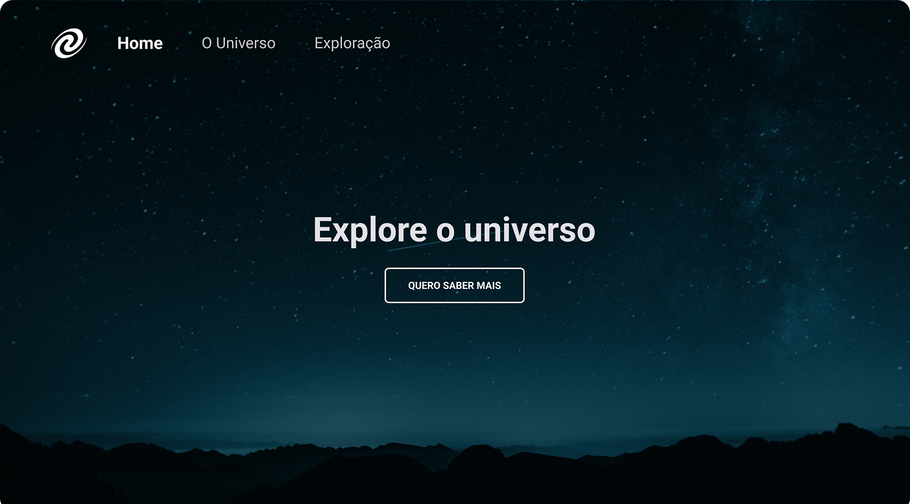

<h1 align="center"> SPA Universe </h1>

Single Page Application

  <a href="#-tecnologias">Tecnologias</a>&nbsp;&nbsp;&nbsp;|&nbsp;&nbsp;&nbsp;
  <a href="#-projeto">Projeto</a>&nbsp;&nbsp;&nbsp;|&nbsp;&nbsp;&nbsp;
  <a href="#memo-licença">Licença</a>

  

 

  

## 🚀 Tecnologias

Esse projeto foi desenvolvido com as seguintes tecnologias:

- HTML e CSS
- JavaScript ES6+
- Figma
- Git e GitHub

## 💻 Projeto

Uma página interativa sobre o universo onde seu conteúdo se altera sem necessitar de um recarregamento completo.

## :memo: Licença

Esse projeto está sob a licença MIT.